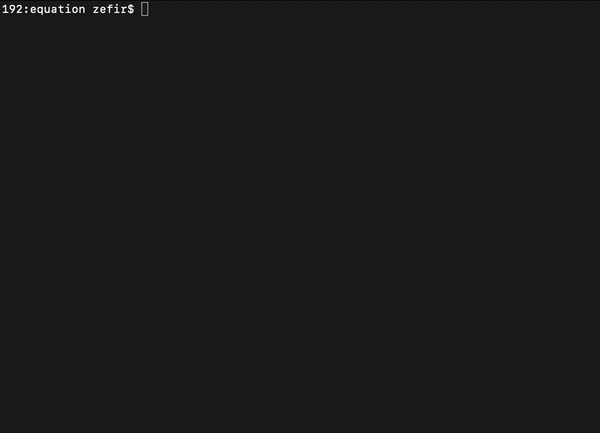

# $> ls

This is an implementation of a Unix utility that my partner and I wrote in C. It can be used to access the display of file and directory information. Using a set of flags, it is possible to display sorting by date of creation, or e.g. to recursively list all files which are nested in the directory specified as a parameter. To read the description of the utility more closely, try typing in the terminal: man ls


## Technologies

1. C
2. Make

## Launch

1. Build a project using Makefile

   ```sh
   $ make
   ```

2. Start the program, like this:

   ```sh
   $ ./ft_ls [-RSUltarru] [file ...]
   ```


## Show

  
